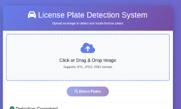

# License Plate Detection System

An automated license plate detection and classification system using deep learning models. The system processes vehicle images, classifies them as interior or exterior views, detects license plates, and automatically blurs them for privacy protection.

## Features

- **Dual Processing Modes**:
  - Basic plate detection ([annotate.py](annotate.py))
  - Advanced detection with interior/exterior classification ([annotate_with_clip.py](annotate_with_clip.py))

- **Intelligent Classification**: Uses CLIP (Contrastive Language-Image Pre-training) to distinguish between interior car photos (dashboard view) and exterior car photos

- **High-Accuracy Detection**: Leverages YOLOS (You Only Look One-level feature) model fine-tuned specifically for license plate detection

- **Privacy Protection**: Automatically blurs detected license plates using Gaussian blur

- **Smart Filtering**: Multiple validation criteria including:
  - Confidence threshold filtering
  - Aspect ratio validation (plates are wider than tall)
  - Minimum area requirements
  - Top-region exclusion (removes mirror reflections)

## Models Used

1. **YOLOS License Plate Detector**: `nickmuchi/yolos-small-finetuned-license-plate-detection`
   - Object detection model specialized for license plates
   - GPU-accelerated processing

2. **CLIP Vision Model**: `openai/clip-vit-base-patch32`
   - Multi-modal model for interior/exterior classification
   - Text-image similarity matching

## Project Structure

```
plate-detection/
├── annotate.py                 # Basic plate detection script
├── annotate_with_clip.py       # Advanced detection with classification
├── requirements.txt            # Python dependencies
├── data/                       # Input images directory
│   ├── VAN6386/               # Sample dataset 1
│   ├── VNC2282/               # Sample dataset 2
│   └── WB1188N_Toyota Camry/  # Sample dataset 3
├── outputs/                    # Processed images
│   ├── exterior/              # Exterior view with detected plates
│   └── interior/              # Interior view (no detection needed)
├── logs.png                    # Processing logs screenshot
└── web-sample.png             # Web interface example
```

## Installation

### Prerequisites

- Python 3.8+
- CUDA-compatible GPU (recommended for faster processing)
- CUDA toolkit and drivers installed

### Setup

1. Clone or download this repository

2. Install required dependencies:
```bash
pip install -r requirements.txt
```

Required packages:
- `transformers` - Hugging Face transformers library
- `torch` - PyTorch deep learning framework
- `pillow` - Python Imaging Library

## Usage

### Basic Plate Detection

Run the basic detection script:

```bash
python annotate.py
```

**Features**:
- Detects license plates with 90% confidence threshold
- Filters by plate area (min 3000 pixels)
- Excludes top 35% of image (removes reflections)
- Validates aspect ratio (1.5 to 6.0)
- Maximum 2 detections per image

### Advanced Detection with Classification

Run the advanced script with interior/exterior classification:

```bash
python annotate_with_clip.py
```

**Features**:
- First classifies image as interior or exterior
- Skips plate detection for interior views
- Detects and blurs plates in exterior views
- Organizes output into separate folders
- Lower confidence threshold (70%) for better recall

## Configuration

### [annotate.py](annotate.py) Parameters

```python
CONFIDENCE_THRESHOLD = 0.9      # Detection confidence (0-1)
MIN_PLATE_AREA = 3000          # Minimum plate area in pixels
MAX_DETECTIONS = 2             # Max plates per image
MIN_ASPECT_RATIO = 1.5         # Min width/height ratio
MAX_ASPECT_RATIO = 6.0         # Max width/height ratio
EXCLUDE_TOP_PERCENTAGE = 0.35  # Exclude top portion (mirrors)
```

### [annotate_with_clip.py](annotate_with_clip.py) Parameters

```python
CONFIDENCE_THRESHOLD = 0.7      # Plate detection confidence
MIN_PLATE_AREA = 2000          # Minimum area for valid plate
MAX_DETECTIONS = 2             # Maximum plates per image
INTERIOR_THRESHOLD = 0.65      # CLIP interior classification threshold
MIN_ASPECT_RATIO = 1.8         # License plate aspect ratio min
MAX_ASPECT_RATIO = 6.0         # License plate aspect ratio max
BLUR_INTENSITY = 60            # Gaussian blur strength
```

## Sample Outputs

### Processing Logs

The system provides detailed logging during processing:


**Log Information**:
- Interior/Exterior classification with confidence scores
- Number of plates detected per image
- Detection confidence percentages
- Processing statistics summary

### Web Interface



*Example of web-based visualization or interface*

### Output Examples

#### Exterior Images with Detected Plates

Processed exterior images can be found in [outputs/exterior/](outputs/exterior/):

- **Successful Detections**:
  - [IMG_8288.jpg](outputs/exterior/IMG_8288.jpg)
  - [IMG_7637.jpg](outputs/exterior/IMG_7637.jpg)
  - [IMG_8289.jpg](outputs/exterior/IMG_8289.jpg)
  - [IMG_9634.jpg](outputs/exterior/IMG_9634.jpg)

- **No Plate Detected** (prefixed with `no-plate_`):
  - [no-plate_IMG_8292.jpg](outputs/exterior/no-plate_IMG_8292.jpg)
  - [no-plate_IMG_7635.jpg](outputs/exterior/no-plate_IMG_7635.jpg)

#### Interior Images (Skipped Detection)

Interior view images saved in [outputs/interior/](outputs/interior/):

- [IMG_7638.jpg](outputs/interior/IMG_7638.jpg)
- [IMG_8290.jpg](outputs/interior/IMG_8290.jpg)
- [IMG_8294.jpg](outputs/interior/IMG_8294.jpg)

### Sample Results

**Exterior Processing**:
- Red bounding boxes around detected plates
- Confidence scores displayed above boxes
- License plates automatically blurred
- No detection marked with `no-plate_` prefix

**Interior Processing**:
- Original images preserved
- No plate detection performed
- Saved separately for organization

## Dataset Organization

Input images should be placed in the `data/` directory. The system recursively processes all images in subdirectories:

```
data/
├── VAN6386/          # 12 images (mixed interior/exterior)
├── VNC2282/          # 18 images (mixed interior/exterior)
└── WB1188N_Toyota Camry/  # 18 images (mixed interior/exterior)
```

Supported formats: `.jpg`, `.jpeg`, `.png`, `.JPG`, `.JPEG`, `.PNG`

## Output Statistics

After processing, you'll see statistics like:

```
Processing Complete!
  Interior images: 29 (saved to outputs/interior/)
  Exterior images: 19 (saved to outputs/exterior/)
  Plates detected: 15
```

## How It Works

### [annotate_with_clip.py](annotate_with_clip.py) Workflow

1. **Load Models**: Initialize CLIP and YOLOS models with GPU acceleration
2. **Image Classification**:
   - Use CLIP to determine if image shows interior or exterior view
   - Compare image against text prompts: "inside a car" vs "exterior of a car"
3. **Conditional Detection**:
   - **Interior**: Skip detection, save to `outputs/interior/`
   - **Exterior**: Proceed to plate detection
4. **Plate Detection**:
   - Run YOLOS object detection
   - Filter by confidence, area, and aspect ratio
   - Keep top 2 detections
5. **Privacy Protection**:
   - Blur detected plate regions with Gaussian filter
   - Draw bounding boxes and confidence scores
6. **Save Results**: Organized output with clear naming

### [annotate.py](annotate.py) Workflow

1. **Load Model**: Initialize YOLOS detector
2. **Process Images**: Iterate through all images in `data/`
3. **Detect & Filter**:
   - Run detection
   - Apply multiple filters (confidence, area, aspect ratio, position)
4. **Annotate**: Draw boxes and confidence scores
5. **Save**: Output to `outputs/` with descriptive naming

## Performance Considerations

- **GPU Acceleration**: Both scripts use GPU (device=0) for faster processing
- **Batch Processing**: Processes entire directories automatically
- **Model Loading**: Models loaded once at startup for efficiency
- **Image Sizes**: Handles various resolutions automatically

## Troubleshooting

### No GPU Available
If CUDA is not available, change `device=0` to `device=-1` in the code to use CPU:
```python
plate_detector = pipeline("object-detection",
                         model="nickmuchi/yolos-small-finetuned-license-plate-detection",
                         device=-1)  # Use CPU
```

### Low Detection Accuracy
- Adjust `CONFIDENCE_THRESHOLD` (lower for more detections)
- Reduce `MIN_PLATE_AREA` for distant plates
- Modify `MIN_ASPECT_RATIO` for different plate types
- Check image quality and lighting conditions

### Too Many False Positives
- Increase `CONFIDENCE_THRESHOLD`
- Increase `MIN_PLATE_AREA`
- Adjust aspect ratio ranges
- Use `EXCLUDE_TOP_PERCENTAGE` to remove reflections

## Technical Details

### Detection Filtering Pipeline

1. **Confidence Filter**: Score >= threshold (70% or 90%)
2. **Area Filter**: Plate area >= minimum pixels
3. **Aspect Ratio Filter**: Width/height within valid range (plates are wider)
4. **Position Filter**: Exclude top portion (mirrors/reflections)
5. **Ranking**: Sort by confidence, keep top N detections

### CLIP Classification

CLIP uses text-image similarity to classify views:
- Interior prompt: "a photo taken from inside a car showing the dashboard and windshield"
- Exterior prompt: "a photo of the exterior of a car with license plate"
- Threshold: 65% confidence for interior classification

## License

This project uses pre-trained models from Hugging Face:
- YOLOS model by nickmuchi
- CLIP model by OpenAI

Please refer to their respective licenses for usage terms.

## Contributing

To improve the detection accuracy:
1. Adjust threshold parameters based on your dataset
2. Add more filtering criteria as needed
3. Fine-tune the CLIP prompts for better classification
4. Experiment with different blur intensities for privacy

## Contact & Support

For issues or questions about this implementation, please refer to the model documentation:
- [YOLOS License Plate Detection](https://huggingface.co/nickmuchi/yolos-small-finetuned-license-plate-detection)
- [CLIP Documentation](https://huggingface.co/openai/clip-vit-base-patch32)

---

**Note**: This system is designed for automated processing of vehicle images while maintaining privacy through license plate blurring. Always ensure you have proper permissions before processing images.
